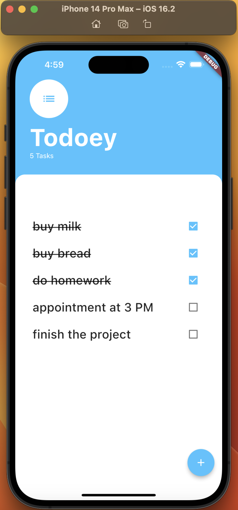

## Todoey

A todolist app to keep track of all your tasks.

## My Goal

Dive into state management in Flutter, explore different architectural options and implement the Provider package to effectively manage app state.

# Visual Demo:

# What I learned
- Understand what state is and why managing it is essential.
- Distinguish between ephemeral (local) state and app-wide state.
- Identify the limitations of relying solely on setState().
- Explore the concept of prop drilling.
- Review popular state management methods for Flutter projects.
- Work with the ListView builder.
- Utilize the Flutter BottomSheet widget.
- Practice lifting state to make it accessible to child widgets.
- Discover the value of design patterns and their applications.
- Learn how the Provider package operates and apply it for app state management.
